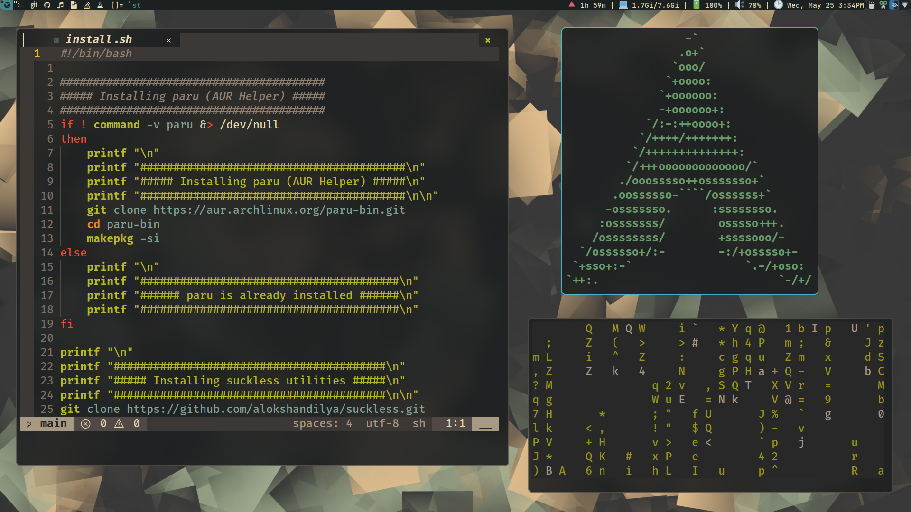
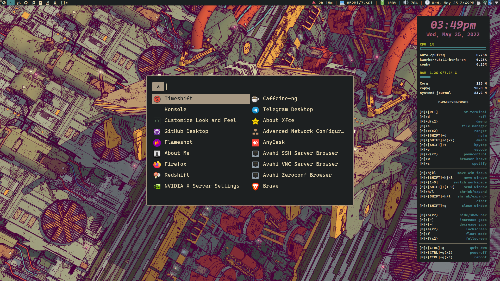
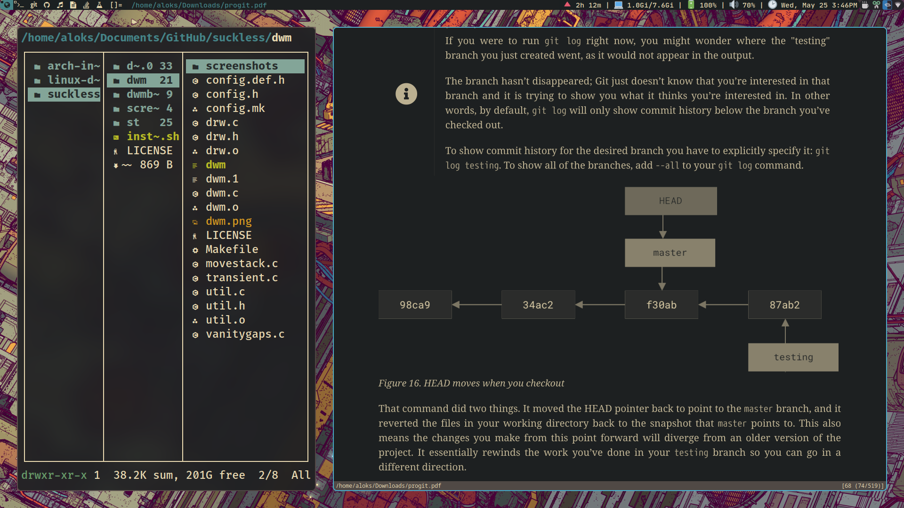
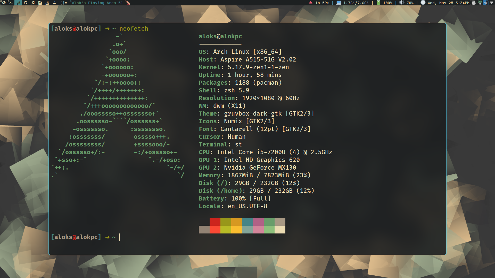

# My Personal DWM build 🌟

## About dwm 🐧

dwm is an extremely fast, small, and dynamic window manager for X.

## Requirements ✏️

- All Requirements will be handled by the `script` assuming you run `Arch Linux` or it's derivatives.
- In order to build dwm you need the Xlib header files.
- [***libxft-bgra***](https://aur.archlinux.org/packages/libxft-bgra-git)
for coloured emojis in suckless utilities.

## Screenshots 🖼️

## Patches 🧰

- ~~notitle~~
- alwayscenter
- fullgaps
- ~~vanitygaps~~
- pertag
- attachbottom
- movestack
- fullscreen
- systray
- cfacts
- ~~autostart~~
- multikey
- ~~rainbow tags~~
- ~~alpha~~
- fixborder
- scratchpad
- ***maybe more I don't remember exactly...***

## Installation 🎙️

- `git clone` this repo and run `install.sh` ...
