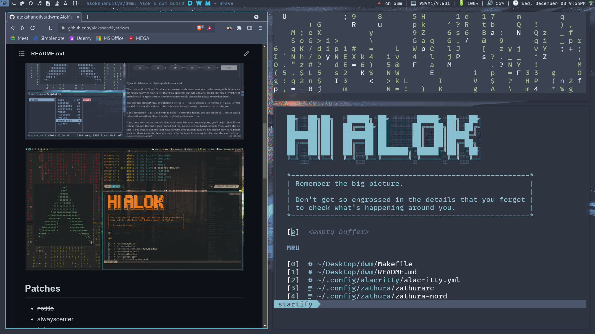
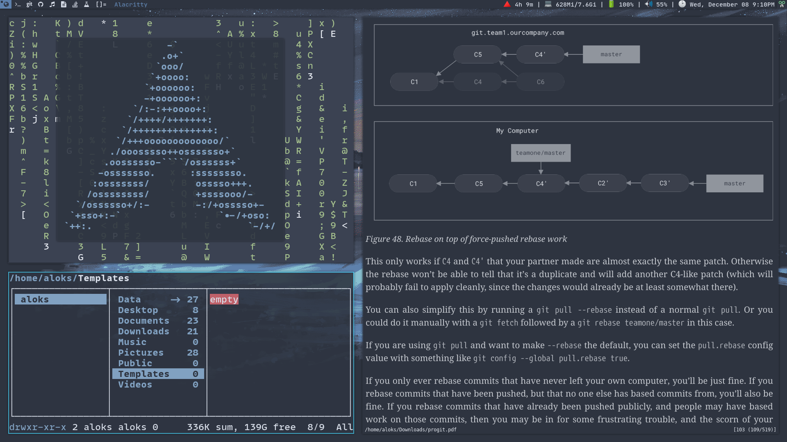
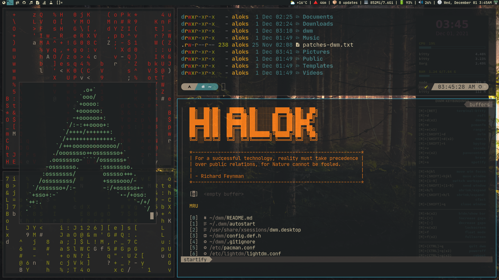

# Suckless DWM 

```
git clone https://github.com/alokshandilya/suckless
```
```
cd suckless/dwm-6.2
```
```
sudo make clean install
```
NOTE - Do the same for st, dwmblocks, dmenu


# Lightdm Entry (Recommended)

Make Lightdm Entry in place of .xstartx for optimus-manager support.

```
cd /usr/share/xsessions/
```
```
sudo vim dwm.desktop
```
Make Desktop Entry for Dwm.
```
[Desktop Entry]
Encoding=UTF-8
Name=dwm
Comment=Dynamic window manager
Exec=/usr/share/xsessions/dwmExec.sh
```
Now, make the start scipt (recommended) or otherwise you can change the value of /usr/share/xsessions/dwmExec.sh to dwm.
```
sudo vim dwmExec.sh
```
make the script file where to want to (/usr/share/xsessions/ in my case)
```
export _JAVA_AWT_WM_NONREPARENTING=1
exec dwm
```
```
sudo chmod +x dwmExec.sh
```
```
sudo pacman -S terminator
```
now, logout and log back in with dwm
```
sudo pacman -S nitrogen picom lxappearance ttf-font-awesome gnome-keyring polkit-gnome numlockx copyq network-manager-applet scrot
```
```
vim .dwm/autostart.sh
```
```
picom -f &
nitrogen --restore &
numlockx on &
/usr/lib/polkit-gnome/polkit-gnome-authentication-agent-1 &
/home/aloks/Documents/Suckless/dwmblocks/dwmblocks &
copyq &
optimus-manager-qt &
nm-applet &
```
* change dwmblocks path to where you have cloned it.
* move scripts to .config/scripts

```
chmod +x .dwm/autostart.sh
```
logout and logback in
```
yay -S libxft-bgra ttf-joypixels ttf-hack 
```
nerd-fonts-complete is optional coz too large package
```
yay -S nerd-fonts-complete
```
or
```
yay -S nerd-fonts-mononoki
```
# My Personal DWM build

## About dwm

dwm is an extremely fast, small, and dynamic window manager for X.

## Requirements

- In order to build dwm you need the Xlib header files.
- [***libxft-bgra***](https://aur.archlinux.org/packages/libxft-bgra-git)
for coloured emojis in suckless utilities.

## Screenshots







## Patches

- ~~notitle~~
- alwayscenter
- fullgaps
- ~~vanitygaps~~
- pertag
- attachbottom
- movestack
- fullscreen
- systray
- cfacts
- ~~autostart~~
- multikey
- rainbow tags
- ~~alpha~~
- fixborder
- ***maybe more I don't remember exactly...***

## Installation

- `git clone` this repo and make, install with super user persmissions.
`sudo make clean install`

## Running dwm

- make `/usr/share/xsessions/dwm.desktop`

``` bash
[Desktop Entry]
Encoding=UTF-8
Name=dwm
Comment=Dynamic Window Manager
Exec=~/.dwm/autostart
```

- make `~/.dwm/autostart` ***e.g***

``` bash
#!/bin/bash
export _JAVA_AWT_WM_NONREPARENTING=1 
/usr/bin/emacs --daemon &
/usr/lib/polkit-gnome/polkit-gnome-authentication-agent-1 &
conky -c ~/.config/conky/gruvbox.conkyrc &

#picom --config ~/.config/picom/picom.conf &
#picom --experimental-backends & disown picom
picom -f & disown picom

./.fehbg &
#nitrogen --restore &

/usr/bin/dunst &
copyq &
#numlockx on &
~/Documents/git-projects/suckless/dwmblocks/dwmblocks &
dwm
```