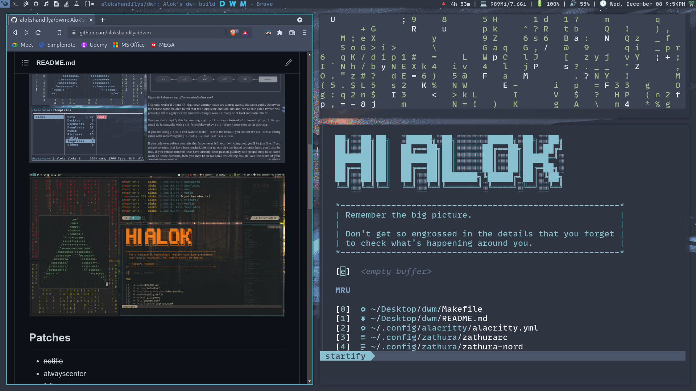
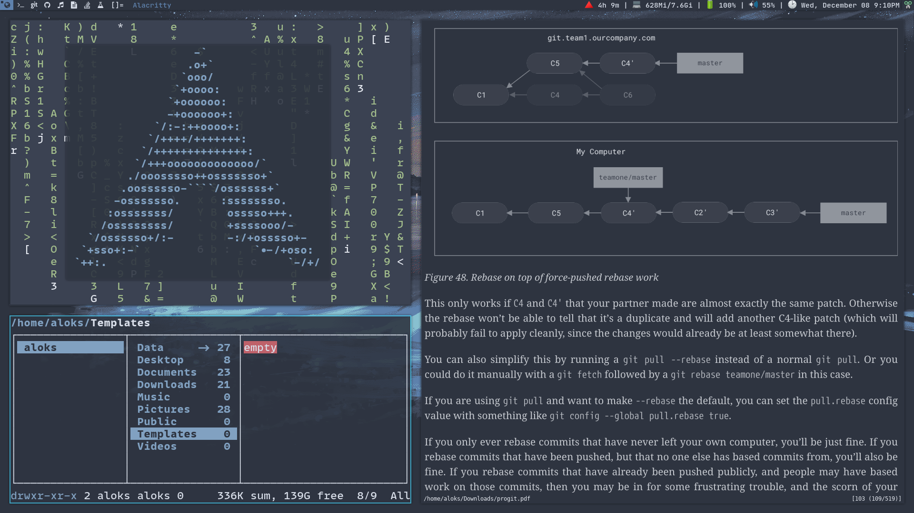
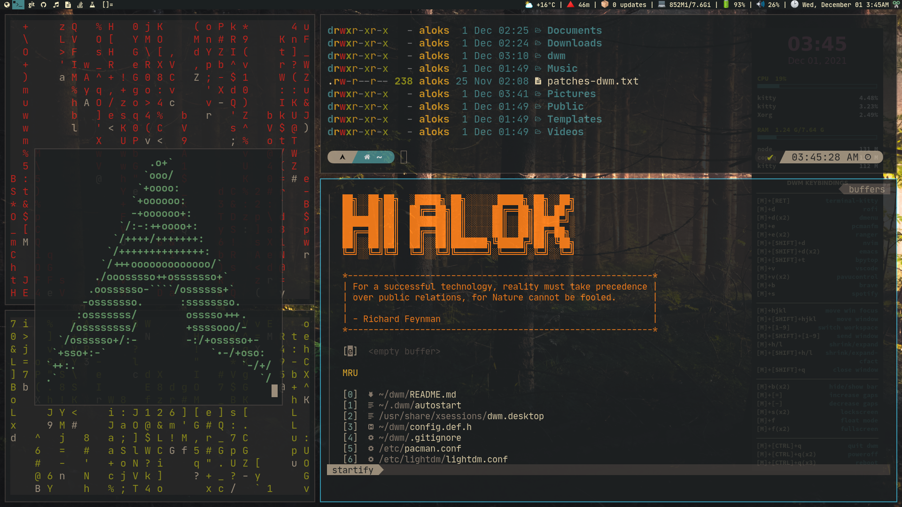

# My Personal DWM build

## About dwm

dwm is an extremely fast, small, and dynamic window manager for X.

## Requirements

- In order to build dwm you need the Xlib header files.
- [***libxft-bgra***](https://aur.archlinux.org/packages/libxft-bgra-git)
for coloured emojis in suckless utilities.

## Screenshots







## Patches

- ~~notitle~~
- alwayscenter
- fullgaps
- ~~vanitygaps~~
- pertag
- attachbottom
- movestack
- fullscreen
- systray
- cfacts
- ~~autostart~~
- multikey
- rainbow tags
- ~~alpha~~
- fixborder
- ***maybe more I don't remember exactly...***

## Installation

- `git clone` this repo and make, install with super user persmissions.
`sudo make clean install`

## Running dwm

- make `/usr/share/xsessions/dwm.desktop`

``` bash
[Desktop Entry]
Encoding=UTF-8
Name=dwm
Comment=Dynamic Window Manager
Exec=~/.dwm/autostart
```

- make `~/.dwm/autostart` ***e.g***

``` bash
#!/bin/bash
export _JAVA_AWT_WM_NONREPARENTING=1 
/usr/bin/emacs --daemon &
/usr/lib/polkit-gnome/polkit-gnome-authentication-agent-1 &
conky -c ~/.config/conky/gruvbox.conkyrc &

#picom --config ~/.config/picom/picom.conf &
#picom --experimental-backends & disown picom
picom -f & disown picom

./.fehbg &
#nitrogen --restore &

/usr/bin/dunst &
copyq &
#numlockx on &
~/Documents/git-projects/suckless/dwmblocks/dwmblocks &
dwm
```
